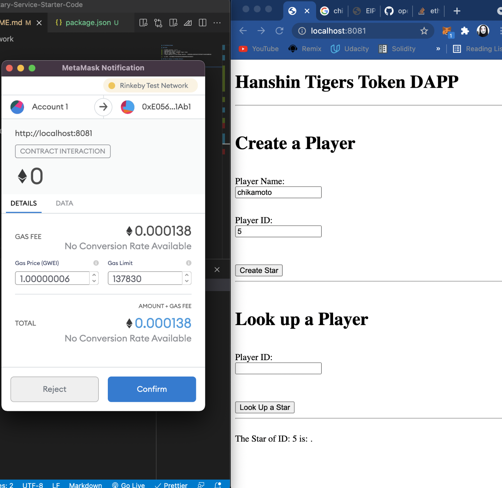

# Hanshin Tigers Token Dapps

Non Fungible Token (NFT, [ERC721](https://github.com/OpenZeppelin/openzeppelin-contracts/blob/master/contracts/token/ERC721/ERC721.sol))



## How to Play

1. install metamask to your chrome brower
2. switch ether network to rinkeby testnet
3. get Ether from [rinkeby faucet](https://faucet.rinkeby.io/)

## Info

- Truffle version : 1.4.1
- OpenZeppelin version : 2.5.1
- ERC-721 Token Name : Hanshin Tigers Token
- ERC-721 Token Symbol : `HTT`
- “Token Address” on the Rinkeby Network : [0xE056A0cc0365CEdC7397E5bE71fa9d33e8BB1Ab1](https://rinkeby.etherscan.io/address/0xE056A0cc0365CEdC7397E5bE71fa9d33e8BB1Ab1)

- my EOA : [0x578BB3C7F2467952F8cAACB05E08D19619386F1F](https://rinkeby.etherscan.io/address/0x578BB3C7F2467952F8cAACB05E08D19619386F1F)

## How to deploy to Rinkeby Network

create `.secret` file with mnemonic

```bash
truffle compile
truffle migrate --reset --network rinkeby
```

- [deploy log](./log-deploy-20210715.txt)
